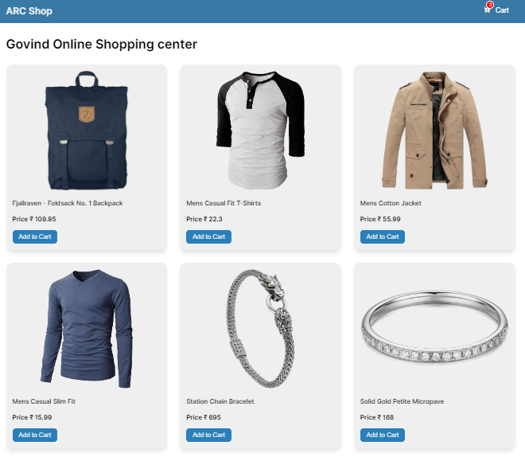

# React + Vite

## https://shopping-cart-gk.netlify.app/

This template provides a minimal setup to get React working in Vite with HMR and some ESLint rules.

# Shopping Cart Application

Ye ek simple React.js based shopping cart application hai, jisme aap alag-alag products ko add kar sakte hain aur unhe cart mein dekh sakte hain.

## Features

- **Add to Cart**: Products ko cart mein add kare.
- **Remove from Cart**: Cart se products ko remove kare.
- **Quantity Update**: Product ki quantity ko update kare.
- **Total Price Calculation**: Cart mein jitne bhi products add hain, unki total price automatically calculate hoti hai.
- **Responsive Design**: Application mobile, tablet, aur desktop devices par ache se kaam karta hai.

## Installation

1. Clone repository: `git clone https://github.com/yourusername/shopping-cart.git`
2. Project directory mein jaaye: `cd shopping-cart`
3. Dependencies install kare: `npm install`
4. Application ko run kare: `npm run dev`
5. Browser mein [http://localhost:5173](http://localhost:5173) open kare.

## Technologies Used

- React.js
- HTML
- CSS

## Folder Structure

